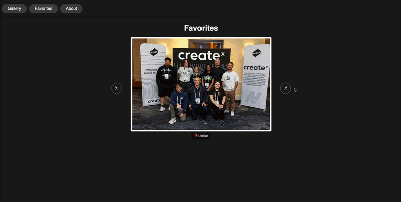

# barkley-photo-gallery

## Description

A React single-page app for browsing a personal photo gallery. Photos are
displayed in a carousel, and you can add new photos (by URL or file upload),
delete them, and "like" the ones you love to save them to a Favorites page.
The app is backed by a small [json-server](https://github.com/typicode/json-server)
REST API.

## Built With

- [React](https://react.dev/) (Create React App)
- [React Router](https://reactrouter.com/)
- [json-server](https://github.com/typicode/json-server)

## Demo



## Features

- Browse all photos in a carousel on the Gallery page (`/`)
- Add a photo by entering an image URL or uploading a file
- Delete a photo from the gallery
- Like a photo to save it to your Favorites
- Unlike a photo to remove it from Favorites (`/favorites`)
- Learn about the project on the About page (`/about`)

## Project Structure

The application lives in the `my-app/`

## Live Links

- Frontend: [https://barkley-photo-gallery.netlify.app](https://barkley-photo-gallery.netlify.app)
- Backend API: [https://barkley-photo-gallery.onrender.com](https://barkley-photo-gallery.onrender.com)

> The frontend is deployed on Netlify, and the JSON Server backend is deployed as a Render Web Service.

## Deployment

### Frontend - Netlify

The React frontend is deployed with Netlify.

Netlify build settings:

- Base directory: `my-app`
- Build command: `npm run build`
- Publish directory: `my-app/build`
- Package directory: Not set

Because this app uses React Router, `my-app/public/_redirects` includes the following rewrite rule so direct links and page refreshes work:

/*    /index.html   200

The frontend calls the API using the `REACT_APP_API_URL` environment variable
(see [Environment Variables](#environment-variables)). `my-app/.env.production`
sets this to the deployed Render backend URL, so Netlify production builds
automatically point at it.

### Backend - Render

The JSON Server backend is deployed as a Render Web Service.

Render settings:

- Root directory: `my-app`
- Build command: `npm install`
- Start command: `npm run server`

The `server` script binds to Render's assigned port:

json-server --watch db.json --host 0.0.0.0 --port ${PORT:-3001}

## Setup

### 1. Clone the repo via SSH

```bash
git clone git@github.com:BarkleyRhoat/barkley-photo-gallery.git
cd barkley-photo-gallery/my-app
```

### 2. Install dependencies

This installs React and `json-server` (both are listed in `package.json`, so no
global install is required):

```bash
npm install
```

### 3. Start the API server

In one terminal, start `json-server` (serves the API on
`http://localhost:3001`):

```bash
npm run server
```

### 4. Start the React app

In a second terminal, start the development server (opens the app on
`http://localhost:3000`):

```bash
npm start
```

## Environment Variables

The frontend reads its API base URL from `REACT_APP_API_URL` (see
`my-app/src/api.js`):

- **Local development:** not set, so requests fall back to
  `http://localhost:3001` (the local `json-server`).
- **Production build:** set in `my-app/.env.production` to the deployed
  Render backend URL, so `npm run build` (used by Netlify) bakes in the
  correct API URL automatically

## Available Scripts

Run these from the `my-app/` directory:

- `npm start` — Run the React app in development mode on port 3000.
- `npm run server` — Run the `json-server` API on port 3001 (watches `db.json`).

## API & Data

The backend is a [json-server](https://github.com/typicode/json-server)
instance reading from `my-app/db.json`. It exposes a single `photos` resource:

- `GET /photos` — list all photos
- `GET /photos?liked=true` — list liked photos (Favorites)
- `POST /photos` — add a photo
- `PATCH /photos/:id` — update a photo (e.g. toggle `liked`)
- `DELETE /photos/:id` — remove a photo

Each photo has the following shape:

```json
{
  "id": 1,
  "url": "https://example.com/photo.jpg",
  "liked": false
}
```

> **Note:** When you add a photo via file upload, the image is stored as a
> base64 data URL directly in `db.json`, which can make that file grow large.

## License

This project is licensed under the [MIT License](./LICENSE).
